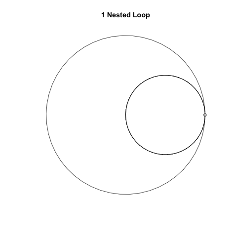

<!-- README.md is generated from README.Rmd. Please edit that file -->

```{r, include = FALSE}
knitr::opts_chunk$set(
  collapse = TRUE,
  comment = "#>",
  fig.path = "man/figures/README-",
  out.width = "100%",
  dpi = 300
)
```

# loopviz

<!-- badges: start -->
<!-- badges: end -->

Visualize nested for loops. Inspiration from [_Programming Loops vs Recursion_](https://www.youtube.com/watch?v=HXNhEYqFo0o) a youtube video by [Computerphile](https://www.youtube.com/channel/UC9-y-6csu5WGm29I7JiwpnA).

## Example

To plot a nested for loop, provide some numbers to `loopviz`. Each number represents the number of iterations. The order represents the hierarchy, i.e. the first number is the top level loop, the second is the first nested loop and so on. For example:

```{r example}
library(loopviz)

loopviz(2, 3)
```

Above we have a for loop which iterates 2 times. Inside that loop there is a nested loop which iterates 3 times. The code would look something like:

```{r}
for (i in 1:2) {
  for (j in 1:3)
    print (j)
}
```

You can let loopviz do the translating with `translate = TRUE`:

```{r, fig.show = 'hide'}
loopviz(2, 3, translate = TRUE)
```

Animating loops is also possible thanks to [gifski](https://github.com/r-rust/gifski):

```{r, eval=FALSE}
loopviz(2, 3, animate = TRUE)
```

```{r, out.width="300px", echo=FALSE, fig.align='center'}

```
