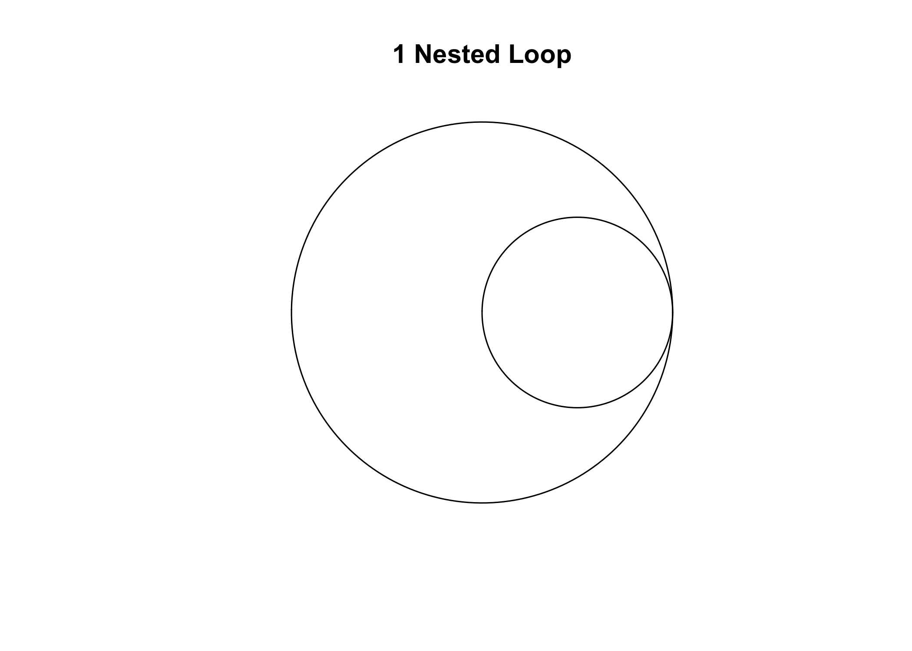

<!-- README.md is generated from README.Rmd. Please edit that file -->

# loopviz

<!-- badges: start -->

<!-- badges: end -->

Visualize nested for loops. Inspiration from [*Programming Loops vs
Recursion*](https://www.youtube.com/watch?v=HXNhEYqFo0o) a youtube video
by
[Computerphile](https://www.youtube.com/channel/UC9-y-6csu5WGm29I7JiwpnA).

## Installation

You can install the released version of loopviz from
[CRAN](https://CRAN.R-project.org) with:

``` r
install.packages("loopviz")
```

## Example

To plot a nested for loop, provide some numbers to `loopviz`. Each
number represents the number of iterations. The order represents the
hierarchy, i.e. the first number is the top level loop, the second is
the first nested loop and so on. For example:

``` r
library(loopviz)

loopviz(2, 3)
```



Above we have a for loop which iterates 2 times. Inside that loop there
is a nested loop which iterates 3 times. The code would look something
like:

``` r
for (i in 1:2) {
  for (j in 1:3)
    print (j)
}
#> [1] 1
#> [1] 2
#> [1] 3
#> [1] 1
#> [1] 2
#> [1] 3
```
